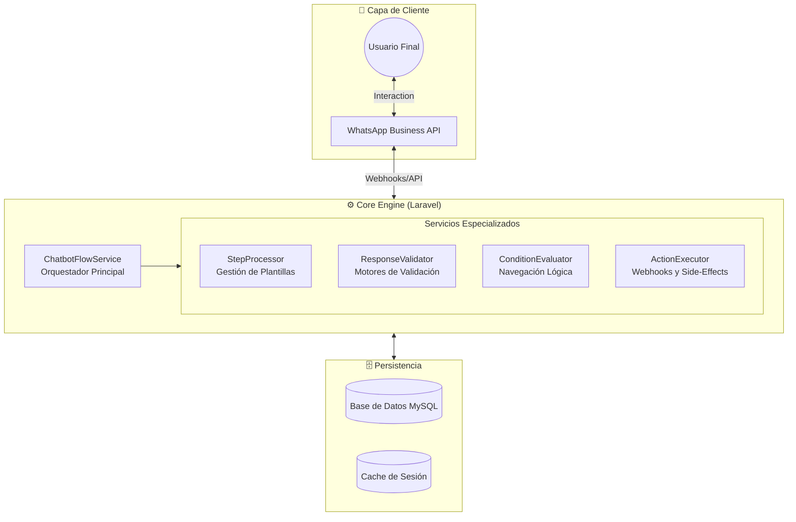
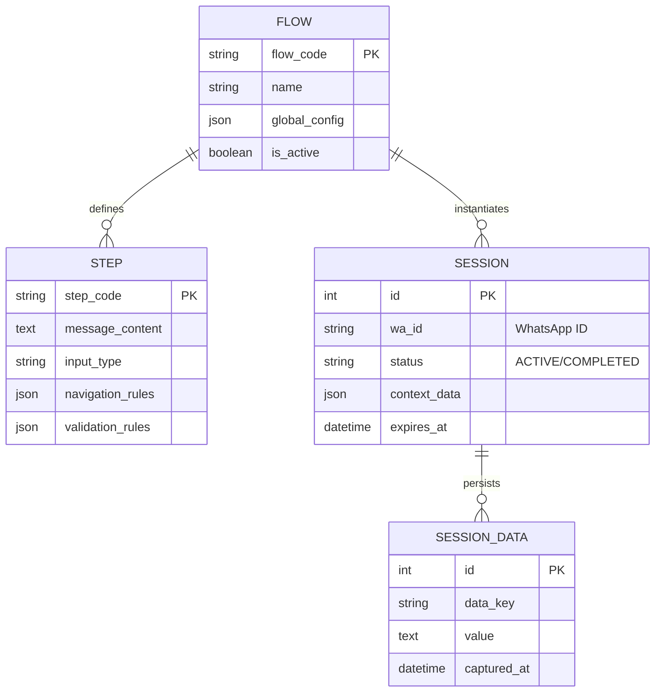
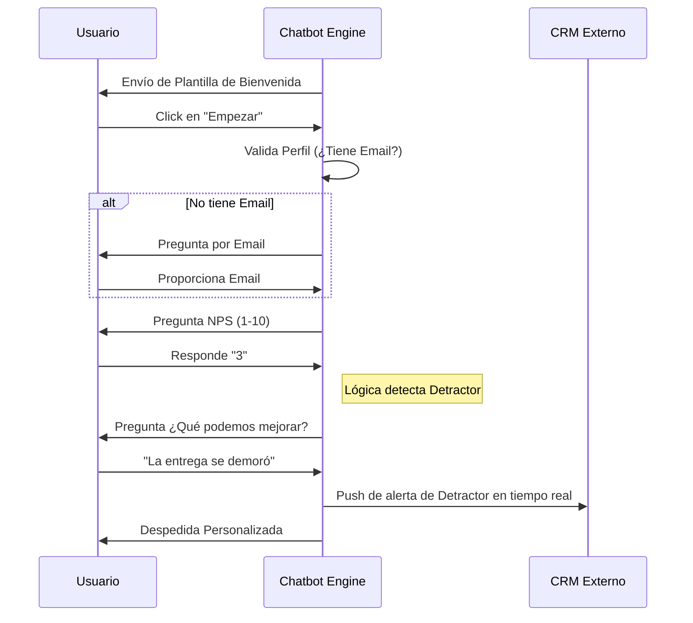

# 🤖 WhatsApp Modular Chatbot Engine

## 📋 Resumen del Proyecto
Este proyecto consiste en un **Motor de Chatbot Modular** desarrollado para una empresa del sector automotriz. El sistema fue diseñado para permitir la creación de flujos conversacionales dinámicos (encuestas NPS, seguimiento de ventas, soporte) de forma 100% declarativa a través de base de datos, eliminando la necesidad de modificar código fuente para implementar nuevos flujos.

> [!NOTE]
> **Aviso de Confidencialidad:** El código fuente original es propiedad privada. Este repositorio sirve como **Caso de Estudio Técnico**, detallando la arquitectura, patrones de diseño y lógica implementada.

---

## 🏗️ Arquitectura del Sistema

El motor utiliza una arquitectura desacoplada donde cada componente tiene una responsabilidad única, facilitando el mantenimiento y la escalabilidad.

---

## ✨ Características Principales

### 1. Motor de Flujos Declarativo
Los flujos no están "hard-coded". Se definen mediante estructuras JSON en la base de datos que especifican:
- **Pasos:** Mensajes, tipos de input y lógica de navegación.
- **Validaciones:** Reglas personalizadas (DNI, Email, Rangos numéricos).
- **Acciones:** Disparadores automáticos al responder (Ej: enviar datos a CRM externo).

### 2. Navegación Inteligente (Branching)
Soporta lógica condicional compleja basada en respuestas previas o datos del cliente.
- **Skip Logic:** Salta preguntas innecesarias si el dato ya existe en el perfil del cliente.
- **Conditional Branching:** Cambia el rumbo de la conversación según la calificación del usuario.

### 3. UX de WhatsApp Business
- **Mensajes Interactivos:** Uso de botones de respuesta rápida y listas para minimizar errores de entrada.
- **Soporte de Plantillas (Templates):** Capacidad de iniciar conversaciones proactivas cumpliendo con las políticas de WhatsApp.

### 4. Robustez y Seguridad
- **Rate Limiting (Debounce):** Protección integrada contra ráfagas de mensajes rápidos para evitar inconsistencias en el estado de la sesión.
- **Session Management:** Gestión de tiempos de expiración y persistencia de datos parciales.

---

## 📊 Modelo de Datos (Esquema ER)

El diseño de la base de datos permite la coexistencia de múltiples flujos activos simultáneamente.

---

## 🛠️ Tecnologías Utilizadas

- **Backend:** Laravel 8.x / PHP 7.4+
- **Database:** MySql 8.0
- **Integraciones:** WhatsApp Business Cloud API
- **Documentación Técnica:** Mermaid.js para diagramas de secuencia e infraestructura.

---

## 📈 Lógica de Navegación (Ejemplo de Caso de Uso NPS)

A continuación se muestra cómo el motor procesa un flujo de satisfacción (NPS) típico:

---

## 💡 Patrones de Diseño Aplicados

- **Strategy Pattern:** Para los diferentes validadores de respuesta.
- **Template Method:** Para el procesamiento estandarizado de cada paso conversacional.
- **State Pattern:** Para gestionar el ciclo de vida de las sesiones de usuario.

---

## 📄 Conclusión
Este proyecto demuestra habilidades avanzadas en arquitectura de software, gestión de APIs de mensajería a escala y diseño de sistemas reactivos orientados a la experiencia del usuario (UX) conversacional.

---
*Este documento fue elaborado como evidencia de capacidad técnica y diseño arquitectónico.*
